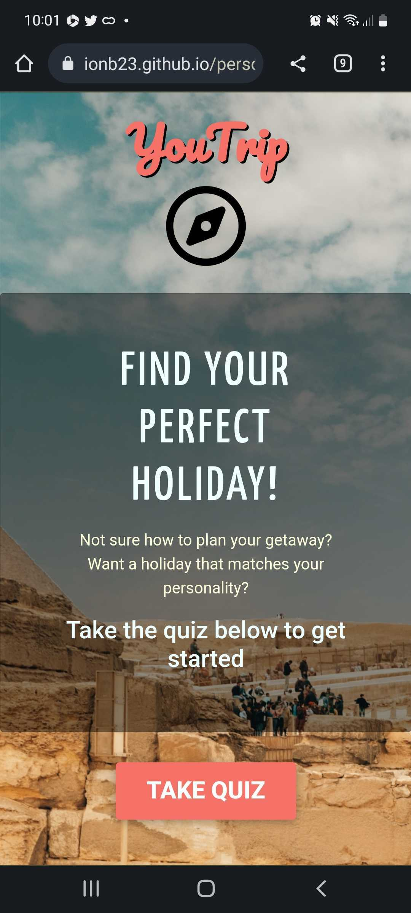
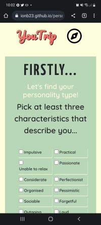
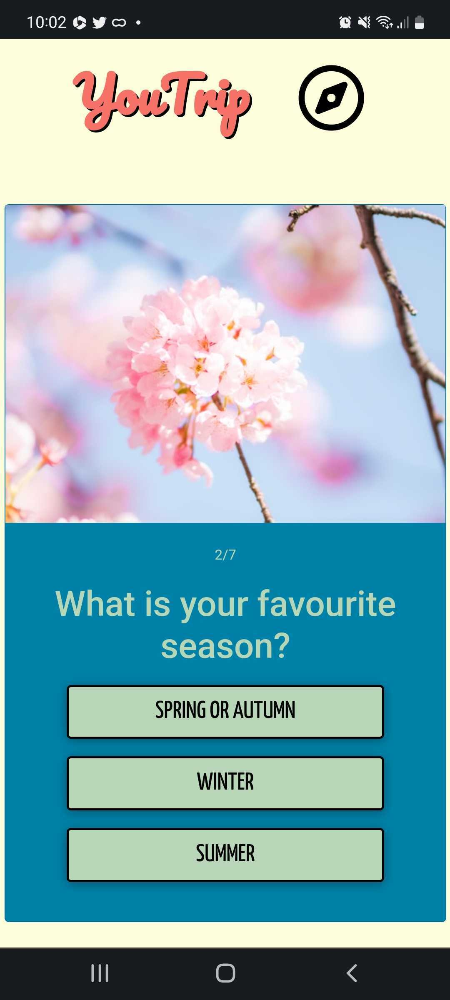
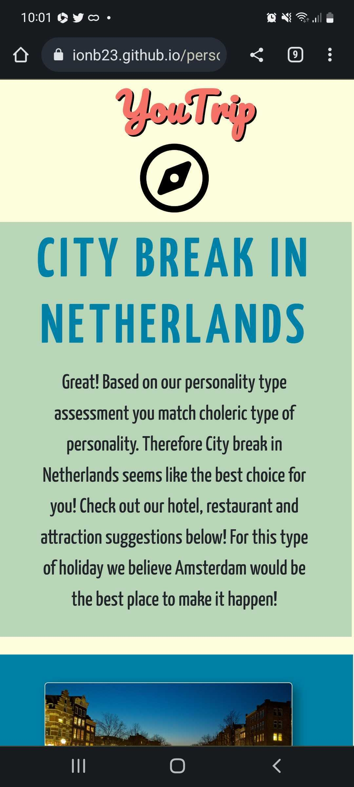
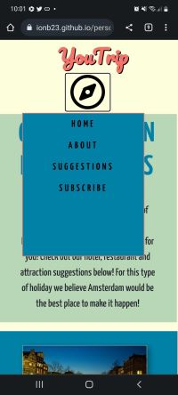

# You trip
Find out what holidays you need!

## Description

This is an interactive website which encourages user to pick and go on holidays based on the personality type assesment.
## Website link
[HERE](https://ionb23.github.io/YouTrip/) You can visit our deployed application.

## Usage
Browse the main page, read the About section, subscribe to the newsletter, click on take the quiz button.
Check at least 3 checkboxes of the personality characteristic. Answer the questions about your personality using the radio buttons. Take the quiz by picking your favourites. See your test results together with suggestions for hotel, attraction and restaurant. 
 
### Main Page
Consists of navigation, where you can read all about our team, subscribe to holidays newsletter or visit suggestions if you have already taken the quiz.
Next on big jumbotron which showcase all sorts of beatuiful destiantions you can find call to action to take a quiz and find out which holidays are most and best suited for your personality.
Next page contains card showcasing different kinds of holiday possibilities.
Then you can see random quote generated by Quotes Villa api.
Page concludes with footer containg icons of social media.

#### On this page we used 
- Bootstrap 4: NavBar, Jumbotron, Cards, Modals
- JQuery: logic for suggestion button to only appear if local storage is filled, AJAX call to the api website
- Styled with additional CSS
- Local Storage

## Quiz Page
NavBar continuing from the main page.
Quiz page starts with personality/temper type assesment which is created as form containing of 16 check boxes and two radio buttons. If criteria of succesfull assesment are not met modal will appear and 'Next' button will not progress the page. If all criteria of checking checkboxes and radio buttons are matched 7 dynamicaly created questions appears one by one with answer buttons. To each answer value is linked to pick from an array of countries typical for nature, history or strong culture.
at the end two piece of information is saved to the local storage (Personality type and holiday preference).

#### On this page we used
- Boootstrap: NavBar,Footer, Cards, Spinners, modals
- JQuery onclick events, logic to count scores and get inputs from checkboxes and radio buttons, dynamically changing layout of the page
- CSS styling and animation used
- Local storage

## Suggestion Page
NavBar,Footer from the main page.
On this site we can find dynamically appearing results of the test and quiz in the first section (description text created automatically using results from outcomesObject.js). Three card with suggestions appears for Attraction, Hotel and Restaurant.

#### On this page we used
- Bootstrap: NavBar,Footer ,Cards
- Travel Advisor API : Especially challenging one out of free easily available apis, in Jquery 7 different calls are used to get information needed and for loop is needed to assure there are no empty reuslt.
- Local storage  

## Mobile view
Our website is phone friendly.

- 
- 
  
-  
  
- 

## Credits
On this project we contributed as a group of developers.

### Elijah Wilsher
Contributed by :
- Creating and styling the main page (CSS, HTML, JQuery, everything on the main page)
- Choosing overall theme and name for the website
- Creating the presentation

### Ion Borziac
Contributed by :
- Sorting Travel Advisor API, JavaScript for suggestion page
- Github management - ensuring safe deployement, merging all the branches
- Creating Google Drive to share ideas and sources

### Fran Rechkova
Contributed by:
- Creating Quiz Page (quiz logic JS and local storage)
- Styling suggestion page, media queries
- ReadME text
